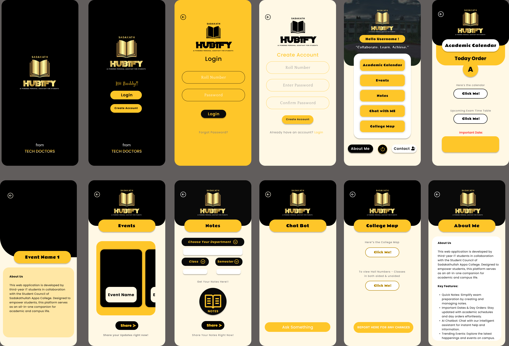

# 📱 Sadakath Hubify – AI-Powered Personal Assistant for Students

**"Learn, Collaborate, Achieve"**

Sadakath Hubify is an **AI-powered mobile  application** built to help college students manage their academic journey with ease. From viewing attendance and exam results to organizing notes, receiving real-time college updates, and accessing an intelligent chatbot — Hubify integrates everything a student needs into one powerful platform.

 

---

## 🚀 Features

### 🔐 User Authentication
- Secure login and signup using Firebase Authentication.
- Personalized dashboards for each student.

### 🤖 AI Chatbot
- Powered by OpenAI API for intelligent academic help, reminders, and FAQs.

### 📚 Notes Organizer
- Upload, categorize, and access study materials and personal notes quickly.

### 📅 Class Schedule Manager
- Department-wise visual timetables.
- Interactive academic calendar with leave and event markers.

### 🔔 Event Notifications
- Real-time alerts for announcements, events, and reminders.

### 📊 CGPA Calculator
- Input semester scores and get real-time CGPA results.

### 🧠 Web Scraping Integration
- Attendance and exam data fetched securely from college portal using Flask backend.

---

## 🛠️ Tech Stack

| Area               | Technology                          |
|--------------------|--------------------------------------|
| **Frontend**       | Flutter (for mobile/web)             |
| **Backend**        | Flask (Python)                       |
| **Authentication** | Firebase Auth                        |
| **Database**       | Firebase Firestore                   |
| **AI Assistant**   | OpenAI API / Dialogflow (optional)   |
| **Design**         | Figma                                |
| **Hosting**        | GitHub Pages (Landing page)          |
| **Version Control**| Git + GitHub                         |

---

## 💡 Use Case

Sadakath Hubify is built for students in colleges where academic data is traditionally scattered across multiple portals or offline records. With this app, students can:

- Instantly check live attendance from the college website.
- View internal and semester results.
- Access academic resources and schedules.
- Stay updated with real-time events and alerts.
- Use AI assistance for productivity, reminders, and doubt clarification.

---
## Sample Login Details

  Roll No - 22sit46
  Password - sudha@23
You can also use Register page for new users

---
## 🖼️ Screenshots

> _Add relevant screenshots here in a `/screenshots` folder and embed them like:_




---
## 📦 Installation

### Flutter Setup

```
git clone https://github.com/sudha2307/sadakath_hubify_.git
cd sadakath_hubify_
flutter pub get
flutter run

```

## 🔑 Important: Don’t Forget Before Running or Deploying Hubify
Make sure to configure the following APIs and services properly:

### ✅ Firebase API

Set up Authentication (Email/Password or Google Sign-In)

Enable Firestore Database

Enable Firebase Storage if uploading files/notes

Get your google-services.json (for Android) and firebase-config.js (for Web)

### ✅ Gemini API (Google AI / Gemini Pro)

Go to https://makersuite.google.com/app

Generate an API key from Google AI Studio

Store it securely (don’t push it to GitHub!)

Use it for AI assistant/chatbot features

### ✅ Dialogflow API (if used as fallback chatbot)

Go to https://dialogflow.cloud.google.com/

Create a new agent

Enable Dialogflow API in Google Cloud Console

Get service-account.json if backend requires authentication

## 📧 Contact

Maintained by [Sudha]([https://www.linkedin.com/in/sudha2307](https://www.linkedin.com/in/sudhakar-m23))
# Links
[Instagram](https://www.instagram.com/_sudha_.exe/#)
[Gmail](mailto:m.sudha23ss@gmail.com)


